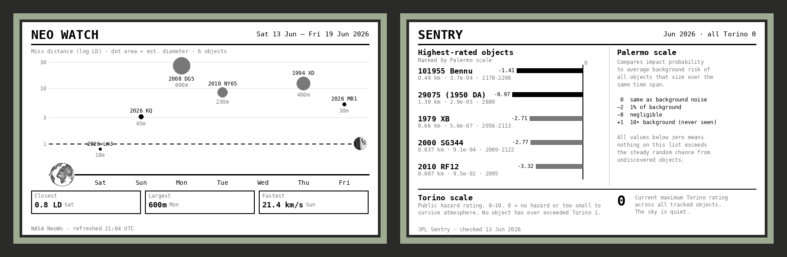

# NEO WATCH Terminal

A retro Mission Control–style e-ink terminal that tracks near-Earth objects using NASA's open APIs.



## What it is

A 3D-printed terminal with a 7.5" e-ink display, powered by a Raspberry Pi Zero, showing two views toggled by a single square push button:

- **NEO WATCH** — this week's asteroid close approaches plotted by distance and day
- **SENTRY** — JPL's impact risk watch list with Palermo and Torino scale ratings

No soldering required.

## Quick start

```bash
# On your Pi (after flashing Raspberry Pi OS Lite and enabling SPI):
sudo apt install -y python3-pip python3-pil python3-numpy python3-requests git
pip3 install RPi.GPIO spidev --break-system-packages

git clone https://github.com/waveshare/e-Paper.git
cd e-Paper/RaspberryPi_JetsonNano/python && pip3 install . --break-system-packages && cd ~

git clone https://github.com/YOURUSERNAME/neo-watch-terminal.git
cd neo-watch-terminal
python3 neo_eink.py
```

## Preview without hardware

```bash
# On any computer with Python 3 and Pillow:
pip install pillow requests
python3 neo_eink.py --preview         # live API data → PNG files
python3 neo_eink.py --preview --mock  # mock data → PNG files (no network needed)
```

## Documentation

See the [wiki](../../wiki) for the full build guide:

- [Bill of Materials](../../wiki/Bill-of-Materials) — shopping list with links
- [Printing Guide](../../wiki/Printing-Guide) — STL settings and finishing
- [Hardware Assembly](../../wiki/Hardware-Assembly) — no-solder assembly instructions
- [Software Setup](../../wiki/Software-Setup) — flashing, installing, auto-start
- [Display Design](../../wiki/Display-Design) — visualization design and customization
- [Troubleshooting](../../wiki/Troubleshooting) — common issues and fixes

## Files

| File | Description |
|------|-------------|
| `neo_eink.py` | Main firmware — fetches APIs, renders views, drives display, handles button |
| `earth_bitmap.png` | Pen-and-ink Earth illustration, pre-processed for e-ink |
| `moon_bitmap.png` | Pen-and-ink Moon illustration, pre-processed for e-ink |
| `terminal.py` | Parametric enclosure generator (Manifold3D + trimesh) |
| `eink_terminal.stl` | Printable enclosure body |
| `eink_plate.stl` | Printable slide-in bottom panel |

## Data sources

- [NASA NeoWs](https://api.nasa.gov/) — near-Earth object close approach data
- [JPL Sentry](https://cneos.jpl.nasa.gov/sentry/) — impact risk monitoring

## License

MIT License
